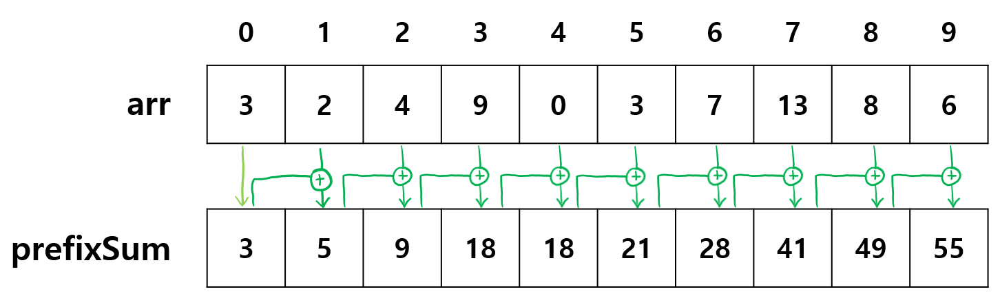
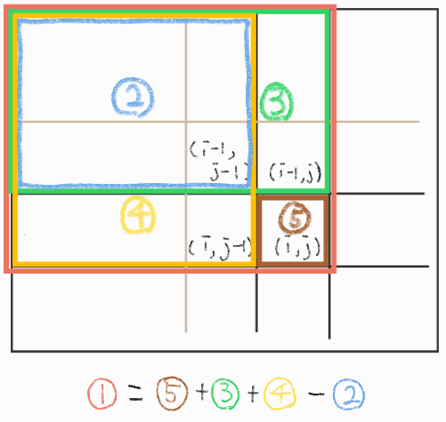
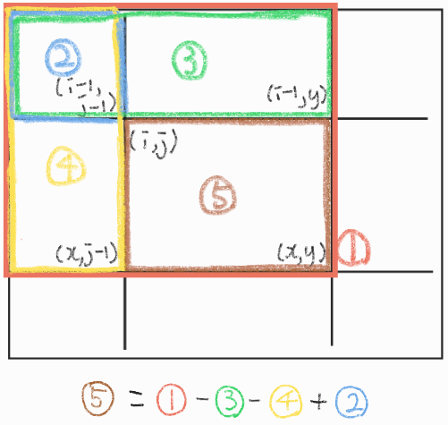

# 누적합 (Prefix Sum)
- 배열의 일부 구간에 대한 합을 빠르게 구할 수 있는 알고리즘
- 배열의 값들이 변하지 않는다면 누적된 합 또한 변동이 없다는 점을 적용
- 미리 구해둔 누적합을 통해 배열 중 특정 구간의 부분합을 쉽게 구할 수 있음
- 값을 미리 저장해두는 점이 DP와 유사

### 누적합의 조건
1. 배열의 값들이 변하지 않음
   
## 1차원 누적합 알고리즘
### 1차원 누적합

- 앞에서부터 차례대로 합계를 prefixSum 배열에 저장함
- 직전 위치까지의 합에 현재 위치의 arr 값을 더하여 현재 위치의 누적합을 구함
- 수식화하면 다음과 같음
    - prefixSum[i] = prefixSum[i-1] + arr[i]
### 시간복잡도: O(n)
   
``` python
def prefix_sum(n):
    prefixSum = [0]*n # prefixSum을 담을 빈 배열 생성
    prefixSum[0] = arr[0] # 첫번째 값을 넣어줌
    for i in range(1,n): # 두번째 값부터 누적합을 저장
        prefixSum[i] = prefixSum[i-1] + arr[i]
    return prefixSum

n = int(input())
arr = list(map(int, input().split()))
prefixSum = prefix_sum(n)
```   
### 1차원 부분합

- *3*에서 *6*까지의 부분합을 구하려면 *6*까지의 합 28에서 *2*까지의 합 9을 빼면됨
- 즉, i ~ j 까지의 합은 j까지의 누적합 - (i-1)까지의 누적합 (i번째 값 포함)
- partSum = prefixSum[j] - prefixSum[i-1]
### 시간복잡도: O(1)
   
``` python
n,m = map(int, input().split())
arr = [list(map(int, input().split())) for _ in range(n)]
s = prefix_sum(n,m) # 누적합을 구함
i,j = map(int,input().split())

partSum = prefixSum[j] - prefixSum[i-1]
print(partSum)
```   

## 2차원 누적합 알고리즘
### 2차원 누적합

- 2차원의 배열에서 1번 핑크색 구역인 (i,j)까지의 누적합은 3번 초록색 구역과 4번 노란색 구역의 합에서 겹치는 부위인 2번 파란색 구역을 제외하고 새롭게 (i,j)에 해당하는 5번 갈색 구역의 값을 더하여 구함
- prefixSum[i][j] = prefixSum[i-1][j] + prefixSum[i][j-1] - prefixSum[i-1][j-1] + arr[i-1][j-1]    


- 예를 들어 위와 같은 배열 arr이 주어졌을 때, 핑크색 구역의 누적합은
    1. arr의 초록색 구역의 누적합, 즉 prefixSum에서의 초록색 동그라미로 표시된 6을 더하고
    2. arr의 노란색 구역의 누적합, prefixSum에서의 노란색 동그라미로 표시된 8을 더하고
    3. arr의 파란색 구역의 누적합, prefixSum에서의 파란색 동그라미로 표시된 4을 빼고
    4. arr의 갈색 동그라미로 표시된 3을 더해줌으로써 구할 수 있음
    > 6 + 8 - 4 + 3 = 13 으로 핑크색 구역의 누적합은 13이 되어 prefixSum 에 저장됨
    

- 원활하게 누적합을 더해주기 위하여 i == 0 or j == 0 에 해당할 경우 prefixSum 이 0이 되도록 함
- arr 보다 prefixSum 의 인덱스가 1씩 큰 것을 주의해야함!

### 시간복잡도: O(n**2)
   
``` python
def prefix_sum(n,m):
    prefixSum = [[0]*(m+1) for _ in range(n+1)]
    for i in range(1,n+1):
        for j in range(1,m+1):
            prefixSum[i][j] = prefixSum[i-1][j] + prefixSum[i][j-1] - prefixSum[i-1][j-1] + arr[i-1][j-1]
    return prefixSum

n,m = map(int, input().split())
arr = [list(map(int, input().split())) for _ in range(n)]
prefixSum = prefix_sum(n,m)
```   

### 2차원 부분합

- 누적합을 사용하여 (i,j)에서 (x,y)까지의 부분합을 쉽게 구할 수 있음
- 5번 갈색 구역의 부분합을 구하기 위해서는
    1. 1번 핑크색 (x,y)의 누적합에서 
    2. 3번 초록색 (i-1,y)의 누적합을 빼고, 
    3. 4번 노란색 (x,j-1)의 누적합을 빼고, 
    4. 중복으로 제외된 2번 파란색 (i-1,j-1)의 누적합을 더함
- partSum = prefixSum[x][y] - prefixSum[i-1][y] - prefixSum[x][j-1] + prefixSum[i-1][j-1]

### 시간복잡도: O(1)
   
``` python
n,m = map(int, input().split())
arr = [list(map(int, input().split())) for _ in range(n)]
prefixSum = prefix_sum(n,m)
i,j,x,y = map(int,input().split()) 
# (i,j)칸에서 (x,y)칸까지 포함한 부분합
partSum = prefixSum[x][y] - prefixSum[i-1][y] - prefixSum[x][j-1] + prefixSum[i-1][j-1]
print(partSum)
```
   
### 누적합 관련 응용 문제
- 백준 2167번
- 백준 2559번
- 백준 17425번
- 백준 10986번
- 백준 11441번