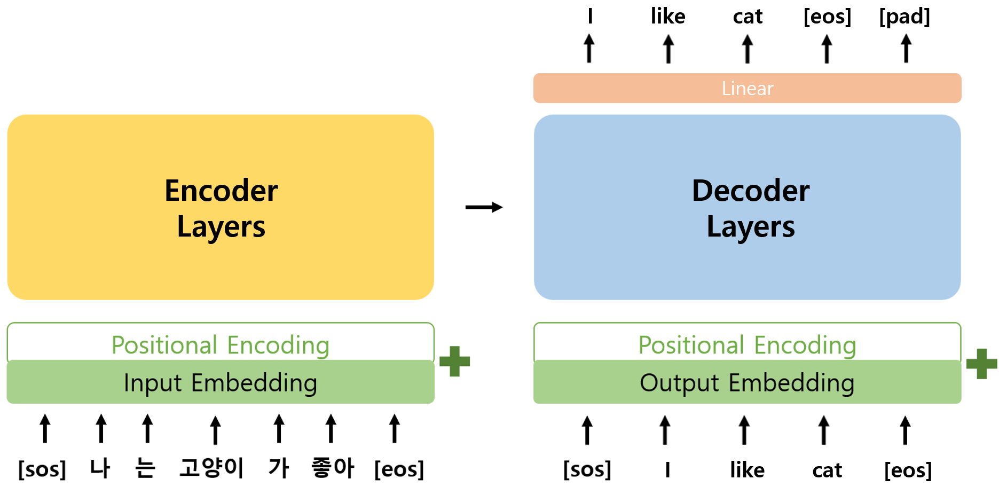
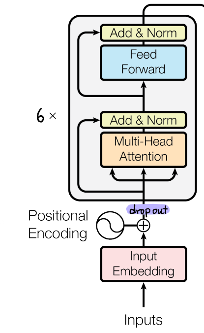
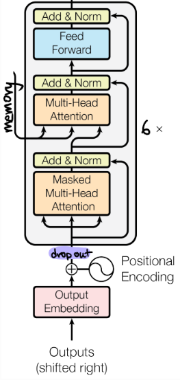
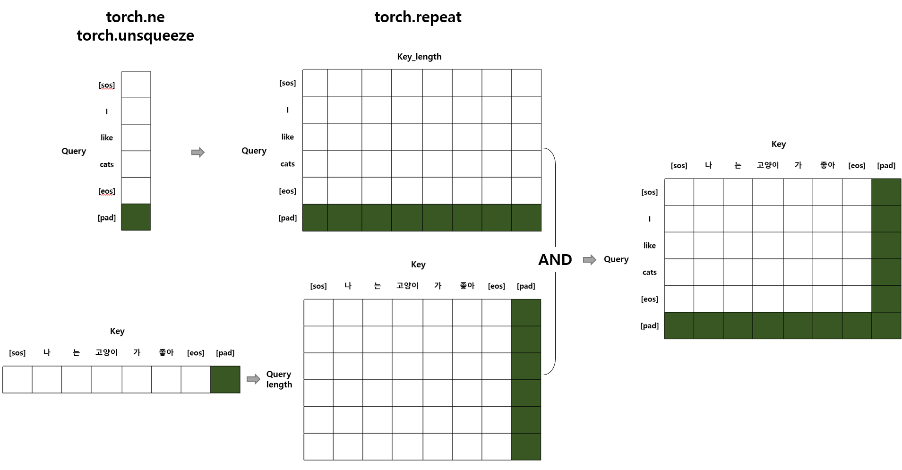

# Model 
<p align="center"></p>

- 앞서 구현한 Layers를 활용하여 Encoder와 Decoder의 class를 구현하고, 이를 합하여 Transformer class를 구현하였다.  

### [목차]
1. [Encoder](#1-encoder)
2. [Decoder](#2-decoder)
3. [Transformer](#3-transformer)

## 1. Encoder
<p align="center"></p>

- Encoder에서는 Input Embedding과 Positional Encoding이  더해져 Encoder Layer에 입력되며 Encoder Layer는 N번 반복되었다.
- 논문에 따르면 Encoder Layer에 입력되기 전 dropout이 적용되었으며, Encoder Layer가 총 6번 반복되었다.

### 1.1. 알고리즘 순서
1. 입력에 대한 input embedding, positional encoding 생성
2. add & dropout
    - input embedding과 positional encoding을 더해주고 dropout 수행한다.
3. n번 EncoderLayer 반복하기 (n_layers)

### 1.2. Encoder 코드
```python
class Encoder(nn.Module):
    def __init__(self, n_input_vocab, d_model, head, d_ff, max_len, padding_idx, dropout, n_layers, device):
        super().__init__()

        # Embedding
        self.input_emb = nn.Embedding(n_input_vocab, d_model, padding_idx=padding_idx)
        self.pos_encoding = PositionalEncoding(d_model, max_len, device)
        self.dropout = nn.Dropout(p=dropout)

        # n개의 encoder layer를 list에 담기
        self.encoder_layers = nn.ModuleList([EncoderLayer(d_model=d_model, 
                                                         head=head, 
                                                         d_ff=d_ff, 
                                                         dropout=dropout)
                                             for _ in range(n_layers)])

    def forward(self, x, padding_mask):
        # 1. 입력에 대한 input embedding, positional encoding 생성
        input_emb = self.input_emb(x)
        pos_encoding = self.pos_encoding(x)
        
        # 2. add & dropout
        x = self.dropout(input_emb + pos_encoding)

        # 3. n번 EncoderLayer 반복하기
        for encoder_layer in self.encoder_layers:
            x, attention_score = encoder_layer(x, padding_mask)
        
        return x
```

## 2. Decoder
<p align="center"></p>

- Decoder는 Encoder와 마찬가지로 Output Embedding과 Positional Encoding이 더해져 Decoder Layer에 입력되며 Decoder Layer는 N번 반복되었다.
- Encoder와 동일하게 Decoder Layer에 입력되기 전 dropout이 적용되었으며, Decoder Layer가 총 6번 반복되었다.

### 2.1. 알고리즘 순서
1. 입력에 대한 output embedding, positional encoding 생성
2. add & dropout
3. n 번 EncoderLayer 반복하기 (n_layers)
    - encoder로부터 memory 전달받음

### 2.2. Decoder 코드
```python
class Decoder(nn.Module):
    def __init__(self, n_output_vocab, d_model, head, d_ff, max_len, padding_idx, dropout, n_layers, device):
        super().__init__()

        # output embbeding 
        self.output_emb = nn.Embedding(n_output_vocab, d_model, padding_idx=padding_idx)
        self.pos_encoding = PositionalEncoding(d_model, max_len, device)
        self.dropout = nn.Dropout(p=dropout)

        # n 개의 decoder layer
        self.decoder_layers = nn.ModuleList([DecoderLayer(d_model=d_model, 
                                                         head=head, 
                                                         d_ff=d_ff, 
                                                         dropout=dropout)
                                             for _ in range(n_layers)])

    def forward(self, x, memory, look_ahead_mask, padding_mask):
        # 1. 입력에 대한 output embedding, positional encoding 생성
        # (batch_size, seq_len, d_model)
        output_emb = self.output_emb(x) 
        # (seq_len, d_model)
        pos_encoding = self.pos_encoding(x) 
        
        # 2. add & dropout
        # (batch_size, seq_len, d_model)
        x = self.dropout(output_emb + pos_encoding) 

        # 3. n번 DecoderLayer 반복하기
        for decoder_layer in self.decoder_layers:
            x = decoder_layer(x, memory, look_ahead_mask, padding_mask)
        
        return x
```

## 3. Transformer
- Transformer에서는 Encoder와 Decoder에 들어가는 mask를 생성하고, Encoder와 Decoder를 수행하면서 Encoder의 output이 memory로써 Decoder에 함께 입력되도록 하며, Decoder의 output이 Linear Layer를 통과하도록 구현하였다.
- 논문에서는 Linear Layer 이후에 Softmax 함수를 통과시키지만, vanishing gradient problem을 고려하여 생략하였다.

### 3.1. 알고리즘 순서
1. 입력에 따른 mask 생성
    - 1) encoder의 self-attention에 들어갈 padding mask
    - 2) decoder의 self-attention에 들어갈 look-ahead mask (padding mask와 결합)
    - 3) decoder의 encoder-decoder attention에 들어갈 encoder-decoder padding mask 
    - masking은 attention score에 적용될 것으로 (batch_size, head, seq_len_q, seq_len_k)의 shape으로 만들어 주어야한다.
2. encoder
3. decoder
    - encoder의 output을 memory로 받음
4. linear layer
    - vocab의 수만큼 선형 변환

### 3.2. Transformer 코드
```python
class Transformer(nn.Module):
    def __init__(self, n_input_vocab, n_output_vocab, d_model, head, d_ff, max_len, padding_idx, dropout, n_layers, device):
        super().__init__()
        self.padding_idx = padding_idx
        self.device = device

        # Encoder
        self.encoder = Encoder(n_input_vocab=n_input_vocab, 
                               d_model=d_model, 
                               head=head, 
                               d_ff=d_ff, 
                               max_len=max_len, 
                               padding_idx=padding_idx, 
                               dropout=dropout, 
                               n_layers=n_layers,
                               device=device)
        
        # Decoder
        self.decoder = Decoder(n_output_vocab=n_output_vocab, 
                               d_model=d_model, 
                               head=head, 
                               d_ff=d_ff, 
                               max_len=max_len, 
                               padding_idx=padding_idx, 
                               dropout=dropout, 
                               n_layers=n_layers,
                               device=device)
        
        # linear layer 
        # (batch_size, seq_len, n_output_vocab)
        self.linear = nn.Linear(d_model, n_output_vocab)

    def forward(self, src, tgt):
        # 1. 입력에 따른 mask 생성
        padding_mask = self.make_padding_mask(src, src)
        enc_dec_padding_mask = self.make_padding_mask(tgt, src)
        look_ahead_mask = self.make_padding_mask(tgt, tgt) * self.make_look_ahead_mask(tgt)

        # 2. encoder
        memory = self.encoder(src, padding_mask)

        # 3. decoder
        output = self.decoder(tgt, memory, look_ahead_mask, enc_dec_padding_mask)

        # 4. linear layer
        output = self.linear(output)
        
        return output

    def make_padding_mask(self, q, k):
        # q,k의 size = (batch_size, seq_len)
        _, q_seq_len = q.size()
        _, k_seq_len = k.size()

        q = q.ne(self.padding_idx)  # padding token을 0, 나머지를 1로 만들어줌
        q = q.unsqueeze(1).unsqueeze(3) # (batch_size, 1, q_seq_len, 1)
        q = q.repeat(1,1,1,k_seq_len)   # (batch_size, 1, q_seq_len, k_seq_len)

        k = k.ne(self.padding_idx)
        k = k.unsqueeze(1).unsqueeze(2) # (batch_size, 1, 1, k_seq_len)
        k = k.repeat(1,1,q_seq_len,1)   # (batch_size, 1, q_seq_len, k_seq_len)

        # and 연산
        # (batch_size, 1, q_seq_len, k_seq_len)
        mask = q & k

        return mask
    
    def make_look_ahead_mask(self, tgt):
        _, seq_len = tgt.size()

        # torch.tril 함수를 사용하여 한칸씩 밀려나며 마스킹을 해줌
        # (seq_len, seq_len)
        mask = torch.tril(torch.ones(seq_len,seq_len)).type(torch.BoolTensor).to(self.device)

        return mask
```

### 3.3. make_padding_mask 함수 작동 방식 참고용 그림
<p align="center"></p>