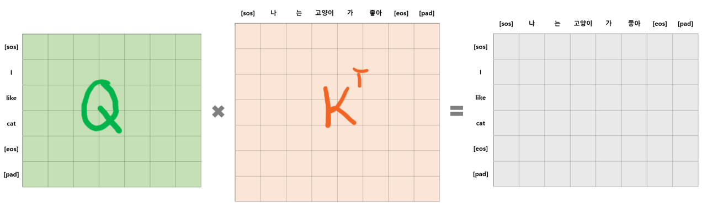
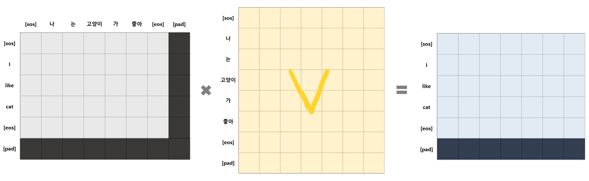

# Layers
<p align="center">
    
    
</p>

- 먼저 구현한 Sub Layers와 PyTorch에서 제공하는 LayerNorm 함수를 활용하여 Encoder Layer와 Decoder Layer의 class를 구현하였다.
- 논문에서 mask는 Decoder Layer에서 한번 사용되었지만 padding token의 학습이 안되어도 됨으로 해당 내용을 추가하여 모든 Attention에서 mask가 사용되었다.

### [목차]
1. [Encoder Layer](#1-encoder-layer)
2. [Decoder Layer](#2-decoder-layer)

## 1. Encoder Layer
<p align="center">
    
</p>

- Encoder Layer에서는 multi-head self-attention layer와 position-wise fully connected feed-forward network layer가 사용되었다.
- 논문에 따라 모든 Sub Layer의 output에 대하여 residual connection과 layer normalization을 적용하였다.
- 각 layer의 output의 demension은 embedding layer와 동일한 $d_{model} = 512$ 이다.

### 1.1. 알고리즘 순서
1. multi-head attention
    - self-attention에 해당한다. 
    - Encoder의 self-attention layer에서는 key, value, query가 같은 input(이전 layer의 output)에서 오기 때문에, 모든 단어의 위치에 대한 attention 정보를 담은 attention score를 얻을 수 있다.
    - 추가적으로 패딩 토큰에 대하여 학습하지 않도록 아래 그림과 같은 패딩 마스크를 사용한다.
<p align="center"></p>

2. add & norm
    > $LayerNorm(x + Sublayer(x))$

    - residual connection을 적용하여 multi-head attention을 들어가지 않은 x와 통과한 Sublayer(x)를 더해준다.
    - 이때 Sublayer(x)에 dropout( $P_{drop} = 0.1$ )을 적용한다.
    - norm 은 layer normalization( $LayerNorm$ )을 의미한다.
3. feed-forward network
    - position-wise fully connected feed-forward network 를 의미한다.
4. add & norm

### 1.2. EncoderLayer 코드
```python
class EncoderLayer(nn.Module):
    def __init__(self, d_model, head, d_ff, dropout):
        super().__init__()
        self.attention = MultiHeadAttention(d_model,head)
        self.layerNorm1 = nn.LayerNorm(d_model)

        self.ffn = PositionWiseFCFeedForwardNetwork(d_model,d_ff)
        self.layerNorm2 = nn.LayerNorm(d_model)

        self.dropout = nn.Dropout(p=dropout)

    def forward(self, x, padding_mask):
        # residual connection을 위해 잠시 담아둔다.
        residual = x
        
        # 1. multi-head attention (self attention)
        x, attention_score = self.attention(q=x, k=x, v=x, mask=padding_mask) 
        
        # 2. add & norm
        x = self.dropout(x) + residual
        x = self.layerNorm1(x)

        residual = x

        # 3. feed-forward network
        x = self.ffn(x)

        # 5. add & norm
        x = self.dropout(x) + residual
        x = self.layerNorm2(x)

        return x, attention_score 
```

## 2. Decoder Layer
<p align="center">
    
</p>

- Decoder Layer에서는 multi-head self-attention layer와 multi-head encoder-decoder attention layer, position-wise fully connected feed-forward network layer가 사용되었다.
- Encoder와 마찬가지로 모든 Sub Layer의 output에 대하여 residual connection과 layer normalization을 적용하였다.

### 2.1. 알고리즘 순서
1. masked multi-head attention
    - self-attention에 해당한다.
    - Decoder의 self-attention layer에서 또한 Encoder의 self-attention layer와 같이 self-attention score를 얻을 수 있다.
    - 하지만 padding mask 대신에 오른쪽 방향으로의 정보 흐름을 유지하는 auto-regressive(자기회귀)한 특성을 위해 **look-ahead mask** 사용한다.
    - look-ahead mask는 $pos$ 번째 위치에 있는 단어의 attention 정보를 얻을 때, $pos$ 번째보다 이후에 있는 단어들을 참고하지 못하도록 하는 마스크이다.
    - 이때 입력되는 look-ahead mask에는 padding mask 정보도 포함된다.
<p align="center"></p> 

2. add & norm
3. multi-head attention
    - encoder-decoder attention에 해당한다. 
    - 이때, query는 decoder에서 올라오고, key, value는 encoder에서 넘어온 값을 사용한다. 따라서 encoder의 모든 단어의 정보가 decoder 단어에 대한 attention 정보에 영향을 미치게 된다.
    - 여기서도 패딩 토큰을 학습하지 않도록 패딩 마스크를 사용한다. 단, encoder-decoder attention인 만큼 input과 output의 패딩 토큰이 있는 곳은 모두 마스킹된다.
    <p align="center">
     <br>
    
    </p> 
4. add & norm
5. position-wise fc feed-forward network
6. add & norm

### 2.2. DecoderLayer 코드
```python
class DecoderLayer(nn.Module):
    def __init__(self, d_model, head, d_ff, dropout):
        super().__init__()
        self.attention1 = MultiHeadAttention(d_model,head)
        self.layerNorm1 = nn.LayerNorm(d_model)
        
        self.attention2 = MultiHeadAttention(d_model,head)
        self.layerNorm2 = nn.LayerNorm(d_model)

        self.ffn = PositionWiseFCFeedForwardNetwork(d_model,d_ff)
        self.layerNorm3 = nn.LayerNorm(d_model)

        self.dropout = nn.Dropout(p=dropout)

    def forward(self, x, memory, look_ahead_mask, padding_mask):
        # 1. masked multi-head attention (self attention)
        residual = x
        x, _ = self.attention1(q=x, k=x, v=x, mask=look_ahead_mask)

        # 2. add & norm
        x = self.dropout(x) + residual
        x = self.layerNorm1(x)

        # 3. multi-head attention (encoder-decoder attention)
        residual = x
        x, _ = self.attention2(q=x, k=memory, v=memory, mask=padding_mask)

        # 4. add & norm
        x = self.dropout(x) + residual
        x = self.layerNorm2(x)

        # 5. feed-forward network
        residual = x
        x = self.ffn(x)

        # 6. add & norm
        x = self.dropout(x) + residual
        x = self.layerNorm3(x)

        return x 
```
