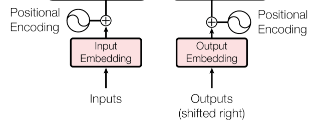
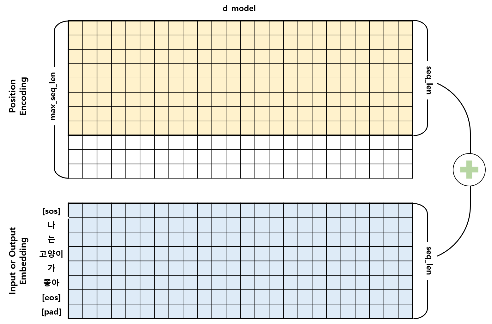

# Embedding
<p align="center"></p>

- Transformer에서 사용되는 Embedding은 Input Embedding과 Output Embedding이 있으며, 이들과 더해지는 Positional Encoding이 있다.
- Input과 Output Embedding은 torch에서 제공하는 nn.Embedding을 사용하였으며, Positional Encoding은 논문에서 제시하는 수식을 따라 Positional Encoding class를 구현하였다. 

## 1. Positional Encoding
<p align="center"></p>

- Positional Encoding은 **시퀀스의 순서(단어의 위치 정보)**를 알려주는 역할을 한다.
- Input과 Output Embedding이 입력될 때 Positional Encoding 정보가 더해져 Encoder와 Decoder에 들어감으로 Embedding과 같은 shape (batch_size, seq_len, $d_{model}$)을 갖는다.
- Positional Encoding 정보는 변하지 않고 Embedding과 같은 seq_len 길이를 가지면 되기 때문에, 시퀀스의 최대 길이(max_seq_len)로 미리 행렬을 초기화를 한 뒤에 입력되는 길이에 맞게 잘라 사용할 수 있다.

### 1.1. 함수
- 논문에서 주어진 함수는 다음과 같다.    
    > $PE_{(pos,2i)} = sin(pos/10000^{2i/d_{model}})$   
    > $PE_{(pos,2i+1)} = cos(pos/10000^{2i/d_{model}})$
- $pos$ 는 단어의 위치이고 $i$ 는 $d_{model}$ 차원의 index를 뜻한다.
- 주기가 $10000^{2i/d_{model}} * 2\pi$ 인 삼각함수이며, $d_{model}$ 차원의 index가 짝수($2i$)일 때 $sine$ 함수를 사용하고, 홀수($2i$)일 때 $cosine$ 함수를 사용

### 1.2. 알고리즘 순서
0. initialization
    1. 비어있는 tensor 생성
    2. pos (0~max_len) 생성 
    3. _2i (0~2i) 생성
    4. 제안된 positional encoding 생성
1. x seq 길이에 맞춰 PE return

### 1.3. MultiHeadAttention 코드
```python
class PositionalEncoding(nn.Module):
    def __init__(self, d_model, max_len, device):
        super().__init__()

        # self.P_E는 (max_len,d_model)로 초기화 -> 입력 seq 길이에 따라 잘라서 사용 (여러번 생성할 필요 없음)
        # 1. 비어있는 tensor 생성
        self.P_E = torch.zeros(max_len, d_model, device=device)
        # 학습되는 값이 아님으로 requires_grad 을 False로 설정
        self.P_E.requires_grad = False

        # 2. pos (0~max_len) 생성 (row => 2d)
        pos = torch.arange(0, max_len, dtype=torch.float, device=device).unsqueeze(dim=1)

        # 3. _2i (0~2i) 생성 (col)
        # 2i는 step = 2 를 활용하여 i의 2배수를 만듦
        _2i = torch.arange(0, d_model, step= 2, dtype=torch.float, device=device)

        # 4. 제안된 positional encoding 생성 (i 짝수 : sin, 홀수 : cos)
        self.P_E[:, 0::2] = torch.sin(pos / 10000 ** (_2i / d_model))
        self.P_E[:, 1::2] = torch.cos(pos / 10000 ** (_2i / d_model))

    def forward(self,x):
        # x seq 길이에 맞춰 PE return 
        # (seq_len, d_model)
        batch_size, seq_len = x.size()
        PE_for_x = self.P_E[:seq_len,:]

        return PE_for_x
```