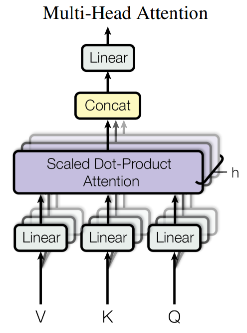
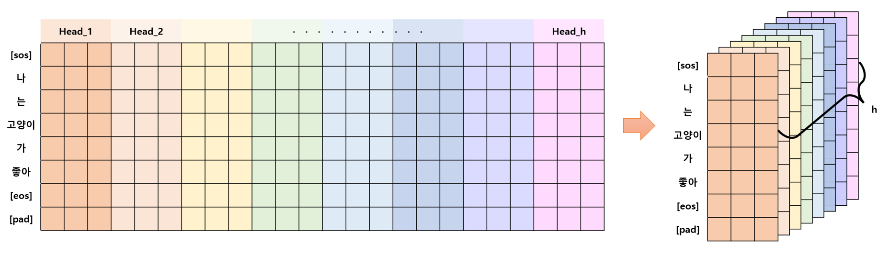
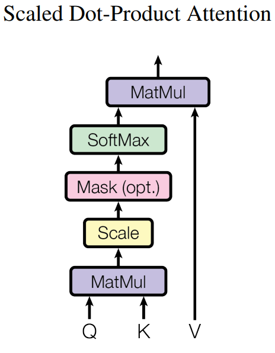
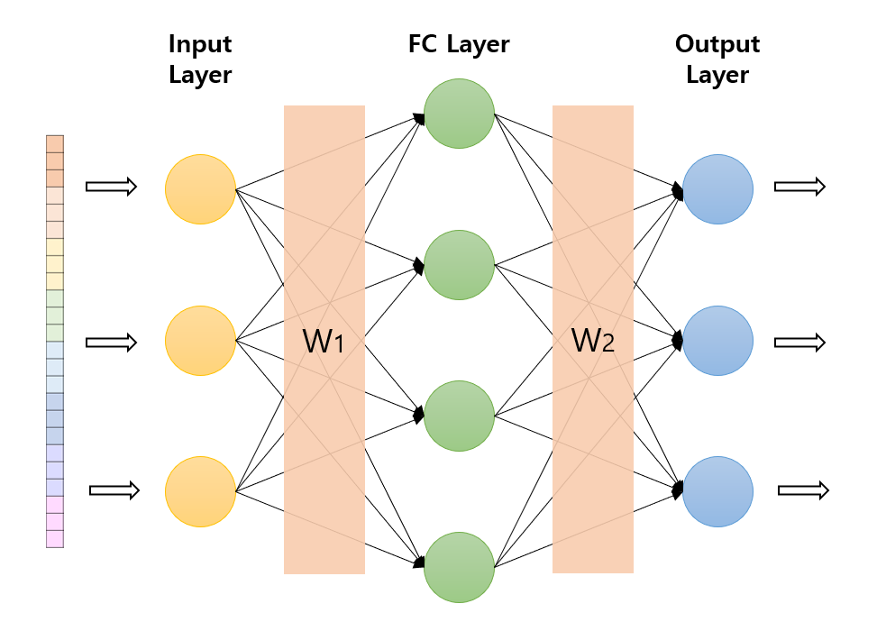

# Sub Layers
- Encoder와 Decoder를 구성하는 Sub Layer로는 Multi-Head Attention과 Position-Wise Fully Connected Feed-Forward Network가 있다.   
- 여기서는 Multi-Head Attention가 Scaled Dot-Product Attention을 포함함으로 총 3가지 class를 만들었다.   
1. [Multi-Head Attention](#1-multi-head-attention)
2. [Scaled Dot-Product Attention](#2-scaled-dot-product-attention)
3. [Position-Wise Fully Connected Feed-Forward Network](#3-position-wise-fully-connected-feed-forward-network)

## 1. Multi-Head Attention
<p align="center"></p>

- Multi-Head 이름은 입력된 Q,K,V 행렬을 Head의 수만큼 나누었기 때문에 붙여졌다.
- 논문에서는 Query, Key, Value 단일 Attention Function을 쓰기보다 Q, K, V를 각각 $d_k, d_k, d_v$ 차원으로 projection하여 Head의 수만큼 $h$ 번 병렬 학습시키는 방법을 선택하였다.
- 여기서 Head를 나눈다는 것은 아래 그림처럼 $d_{model}$ 차원을 h개로 분리한다는 것이다.
<p align="center"></p>

### 1.1. 함수
- 논문에서 주어진 함수는 다음과 같다.   
> $MultiHead (Q, K, V) = Concat(head_1, ..., head_h)W^O,$    
> $where$  $head_i = Attention(QW^Q_i, KW^K_i, VW^V_i)$    

- 논문에서는 $d_{model} = 512,  h = 8,  d_k = d_v = \frac{d_{model}}{h} = 64$ 을 사용하였다.

### 1.2. 알고리즘 순서
1. $Q,K,V$ 를  $d_k, d_k, d_v$ 차원으로 projection
    - projection 한다는 것은 Linear Layer (fc layer)를 통과한다는 것이다.
    - 이때, 실질적으로는 $d_{model}$ 차원으로 projection을 하고 Head를 나누어 h개의 q,k,v 가 각각 $d_k, d_k, d_v$ 차원을 갖게 함으로써 병렬처리를 할 수 있다.
2. $Q,K,V$를 head 수 만큼 분리해주기
    - (batch_size, seq_len, d_model) -> (batch_size, head, seq_len, head_dim)
    - head_dim은 $d_k = d_v = \frac{d_{model}}{h}$ 값을 의미한다.
3. Scaled Dot-Product Attention 을 수행하기
4. 분리된 head들을 다시 concat 하기
    - (batch_size, head, seq_len, head_dim) -> (batch_size, seq_len, d_model)
5. $d_{model}$ 차원으로 projection

### 1.3. MultiHeadAttention 코드
```python
class MultiHeadAttention(nn.Module):
    def __init__(self,d_model,head):
        super().__init__()
        self.d_model = d_model
        self.head = head
        self.head_dim = d_model // head
        self.w_q = nn.Linear(d_model,d_model)
        self.w_k = nn.Linear(d_model,d_model)
        self.w_v = nn.Linear(d_model,d_model)
        self.w_o = nn.Linear(d_model,d_model)
        self.attention = ScaleDotProductAttention()

    def forward(self, q, k, v, mask=None):
        #  [batch_size, seq_len, d_model]
        batch_size, _, _ = q.size()

        # 1. Q,K,V를  d_k, d_k, d_v 차원으로 projection
        q, k, v = self.w_q(q), self.w_k(k), self.w_v(v)

        # 2. Q,K,V를 head 수 만큼 분리해주기 
        # -> (batch_size, head, seq_len, head_dim)
        # 디코더에서는 q와 k,v 의 seq_len 가 다른 경우가 올 수 있음
        q = q.view(batch_size, -1, self.head, self.head_dim).transpose(1,2)
        k = k.view(batch_size, -1, self.head, self.head_dim).transpose(1,2)
        v = v.view(batch_size, -1, self.head, self.head_dim).transpose(1,2)

        # 3. Scaled Dot-Product Attention 을 수행하기
        out, attention_score = self.attention(q,k,v,mask)

        # 4. 분리된 head들을 concat 하기
        # -> (batch_size, seq_len, d_model)
        out = out.transpose(1,2).contiguous().view(batch_size, -1, self.d_model)

        # 5. d_model 차원으로 projection
        out = self.w_o(out)

        return out, attention_score
```

## 2. Scaled Dot-Product Attention
<p align="center"></p>

- Scaled Dot-Product 이름은 attention 내에서 Dot-Production 즉, 내적이 사용되고 Scale 비율이 조정되기 때문에 붙여졌다.
- 여기서 MatMul(matrix multiple)은 두 개의 행렬에 대하여 내적을 계산하는 함수이다.
- Scale은 MatMul을 통과한 행렬에 $\frac{1}{\sqrt{d_k}}$ 을 곱하여 행렬값들이 너무 커지지 않도록 크기를 줄여주는 역할을 한다.
- Mask를 사용한다면, 마스킹된 값을 −∞로 만들어 $SoftMax$ 를 통과할 때 0 값을 갖도록 함으로써 학습이 되지 않도록 한다.

### 2.1. 함수
- 논문에서 주어진 함수는 다음과 같다.   
> $Attention(Q,K,V) = softmax(\frac{QK^T}{\sqrt d_k})V$    

- Q,K,V 의 shape은 (batch_size, head, seq_len, head_dim) 이다.

### 2.2. 알고리즘 순서
1. $K$ 를 transpose하기
2. $Q$ 와 $K^T$ 의 MatMul
3. Scaling
    - $\sqrt{d_k}$ 으로 나누기
4. Mask가 있다면 해당 부위 $-1e10$ 으로 채우기
    - 논문에서는 setting to −∞ 라고 표현하였지만, 모델을 만들때는 $-1e10$ 를 사용하였다.
5. $Softmax$ 취하기
    - 결과값은 $Q$의 단어들과 $K$ 의 단어들의 관계를 확인하는데 사용 가능하다.
    - (batch_size, head, q_seq_len, k_seq_len)
6. Attention 결과와 $V$ 의 MatMul 계산하기

### 2.3. ScaleDotProductAttention 코드
```python
class ScaleDotProductAttention(nn.Module):
    def __init__(self):
        super().__init__()
        self.softmax = nn.Softmax(dim=-1)
        
    def forward(self, q, k, v, mask=None):
        # scaling에 필요한 head_dim 값 얻기
        # (batch_size, head, seq_len, head_dim)
        _, _, _, head_dim = q.size()

        # 1. K를 transpose하기 (seq_len, head_dim의 행렬 전환)
        k_t = k.transpose(-1,-2)

        # 2. Q 와 K^T 의 MatMul
        # (batch_size, head, q_seq_len, k_seq_len)
        attention_score = torch.matmul(q,k_t)

        # 3. Scaling
        attention_score /= math.sqrt(head_dim)

        # 4. Mask가 있다면 마스킹된 부위 -1e10으로 채우기
        # mask는 단어가 있는 곳(True), 마스킹된 곳(False)으로 표시되었기 때문에 False(0)에 해당되는 부분을 -1e10으로 masking out한다.
        # Tensor.masked_fill_(mask_boolean, value) 함수는 True값을 value로 채운다.
        if mask is not None:
            attention_score = attention_score.masked_fill(mask==0,-1e10) 
        
        # 5. Softmax 취하기 
        attention_score = self.softmax(attention_score)

        # 6. Attention 결과와 V의 MatMul 계산하기
        result = torch.matmul(attention_score, v)
        
        return result, attention_score
```

## 3. Position-Wise Fully Connected Feed-Forward Network
<p align="center"></p>

- 그림처럼 Fully connected feed-forward network가 단어 즉, 각 단어의 위치마다 적용되기 때문에 position-wise라고 표현된 것이다.

### 3.1. 함수
- 논문에서 주어진 함수는 다음과 같다.    
> $FFN(x) = max(0, xW_1+b_1)W_2 + b_2$    
- 논문에서 $d_{model}=512, d_{ff} = 2048$을 사용한다.
- 함수에서 $max(0,X)$ 는 ReLU 활성함수 사용을 의미하며,
- $xW+b$ 는 Linear Layer (fc layer)를 통과하는 것을 의미한다.

### 3.2. 알고리즘 순서
1. x의 Linear Layer1 통과
2. ReLU 적용
3. Linear Layer2 통과

### 3.3. PositionWiseFCFeedForwardNetwork 코드
```python
class PositionWiseFCFeedForwardNetwork(nn.Module):
    def __init__(self,d_model,d_ff):
        super().__init__()
        self.w_1 = nn.Linear(d_model,d_ff)
        self.relu = nn.ReLU()
        self.w_2 = nn.Linear(d_ff,d_model)
    
    def forward(self, x):
        # Linear Layer1
        x = self.w_1(x)

        # ReLU
        x = self.relu(x)
        
        # Linear Layer2
        x = self.w_2(x)

        return x
```