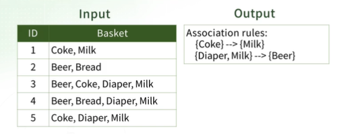

## 목차
1. [빈발 아이템 마이닝에 대한 동기](#1-빈발-아이템-마이닝에-대한-동기)

## 1. 빈발 아이템 마이닝에 대한 동기
### Market-Basket Model
- 목표: 많은 고객이 같이 구매하는 아이템을 찾는 것 => Association Rule(연관 규칙)을 찾는 것
- 접근법: 거래 데이터를 수집 및 분석하여 연관 있는 아이템 찾음
- ex) 기저귀와 우유 구매 -> 맥주 구매 (생각지도 못한 연관성을 찾을 수 있음)
 >    
 >> Input(baskets: 아이템들의 집합): 거래 ID 마다 구매한 물건(items) 목록    
 >> 구매 내역 분석을 통해서 연관 규칙을 찾을 수 있음     
 >> Output(연관 규칙): 콜라를 사면 우유를 항상 삼 / 기저귀와 우유를 사면 맥주를 삼    
    
---
### 응용(1)
- 응용은 basket과 item을 어떻게 정의하는지에 따라 달라짐
- ex) 마트에는 사용자가 어떤 것을 함께 구매하는지에 대한 엄청난 양의 데이터를 갖고 있음
 - **Input**: items = 물건들; baskets = 물건들의 집합들
 - **Output**: 분석을 통해 연관 규칙을 발견
 - **응용**
     1. 관련된 물품들을 함께 배치 -> 매출 증가
     2. 할인 행사 등에 활용 (기저귀를 사면 맥주 구매 가능성이 높다   
         -> 기저귀는 할인하고 맥주는 가격을 올릴 수 있음   
         -> 고객은 할인 받는다고 느끼나 마트 입장에서는 결과적으로 할인이 아님   
         -> 매출 증가   
    
     - [X] 여기서 중요한 점은 **빈발한** 나타나는 규칙을 찾는 것!
   
---
### 응용(2)
 - 